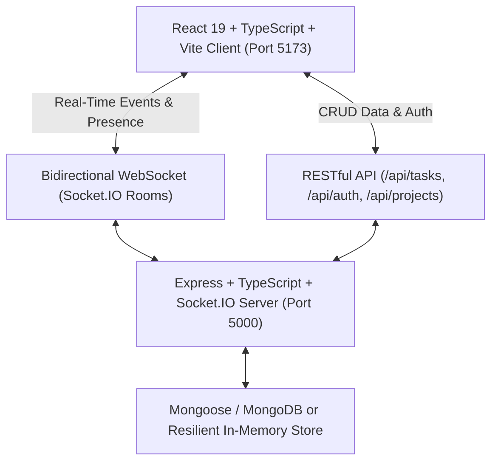

# ⚡ TaskPulse — Real-Time Collaboration & Task Management Platform

> 🚀 **Live Demo:** **[https://taskpulse-collab.onrender.com](https://taskpulse-collab.onrender.com)**

[](https://taskpulse-collab.onrender.com)

[](#)
[](#)
[](#)
[](#)
[](#)
[](#)
[](#)
[](LICENSE)
[](https://render.com/deploy?repo=https://github.com/mishra988/taskpulse-collab)

A modern, high-performance, full-stack real-time collaboration and task management platform built with the **MERN Stack**, **TypeScript**, and **Socket.IO**. Designed with instant bidirectional state synchronization, collaborative cursor/presence indicators, interactive Kanban boards, and a resilient data architecture.

---

## 🌟 Key Features

* **⚡ Real-Time Kanban Board:** Drag-and-drop tasks across 5 customizable stages (*Backlog*, *To Do*, *In Progress*, *In Review*, *Done*) with instant, zero-latency broadcast to all active team members.
* **👥 Live Collaborator Presence:**
  * Real-time online member indicators in the workspace header with pulsing activity rings.
  * Live task inspection indicators (`"Sarah is viewing"` / `"Alex is editing"`) visible across cards.
* **💬 Real-Time Discussion & Comments:** Comment on any task in real-time with threaded timestamps and team avatars.
* **📜 Live Activity Stream:** Audit log drawer tracking who created, moved, edited, commented, or deleted tasks in real-time.
* **🎉 Interactive Feedback & Confetti:** Celebratory particle effects when tasks are moved to "Done" and floating toasts for remote team member actions.
* **🛡️ Resilient Data Engine (Hybrid Mongo & In-Memory):**
  * Fully configured for **MongoDB / MongoDB Atlas** via Mongoose.
  * Includes an automatic, zero-configuration **In-Memory fallback** preloaded with realistic tasks and personas, allowing immediate testing without requiring local database setup!
* **🎭 Multi-Persona Testing Switcher:** Switch between team members (*Ayush*, *Sarah*, *Alex*) in one click to simulate multi-user collaboration across browser tabs.

---

## 🏗️ Architecture & Tech Stack



### Frontend (`/client`):
* **React 19 & TypeScript:** Type-safe components and hooks.
* **Socket.IO Client:** Bi-directional websocket connection management with reconnection policies.
* **Tailwind CSS & Custom Design System:** Dark slate aesthetic, glassmorphic panels, and custom responsive layouts.
* **Lucide Icons & Canvas Confetti:** Clean iconography and celebratory visual feedback.

### Backend (`/server`):
* **Node.js & Express with TypeScript:** Robust typed REST API architecture.
* **Socket.IO:** Room-based real-time broadcasting (`project:proj_main`).
* **Mongoose & MongoDB:** Data schemas, models, and indexing for Tasks, Projects, Users, Comments, and Audit Activities.
* **JWT & bcryptjs:** Secure authentication token generation and password hashing.
* **TSX:** Ultra-fast TypeScript execution and hot reloading in development.

---

## 🚀 Quick Start Guide

### Prerequisites
* **Node.js** (v18 or higher installed)
* **npm** (installed with Node)

### 1. Installation
All dependencies for both client and server can be installed with:
```bash
# In the root taskflow-collab directory:
npm run dev
```

*(Alternatively, to install individually):*
```bash
# Server dependencies
cd server
npm install

# Client dependencies
cd ../client
npm install
```

### 2. Running in Development
From the root directory, launch both the client and server concurrently with one command:
```bash
npm run dev
```

* **Client UI:** `http://localhost:5173`
* **Server API:** `http://localhost:5000`
* **WebSocket Endpoint:** `ws://localhost:5000`

---

## 🧪 Testing Real-Time Collaboration (Two Tabs)

To experience the real-time collaboration features immediately:
1. Open **`http://localhost:5173`** in **Tab 1** (logged in as *Ayush*).
2. Open **`http://localhost:5173`** in **Tab 2** or an Incognito window.
3. In **Tab 2**, click on the user profile in the top-right and switch to **Sarah Chen** or **Alex Miller**.
4. Drag a task from **"To Do"** to **"In Progress"** in Tab 1 — watch it update **instantly** in Tab 2 with a toast notification and live activity feed update!
5. Click to view a task in Tab 2 — notice Tab 1 displaying an active badge: *"Sarah Chen is viewing"*.

---

## 📡 Real-Time Socket Events

| Event Name | Direction | Payload | Description |
| :--- | :--- | :--- | :--- |
| `JOIN_PROJECT` | Client ➔ Server | `{ projectId, user }` | Joins a collaborative project room |
| `ACTIVE_USERS` | Server ➔ Client | `ActiveUserPresence[]` | Broadcasts list of currently active collaborators |
| `TASK_CREATE` | Client ➔ Server | `Partial<ITask>` | Creates task and notifies room |
| `TASK_CREATED` | Server ➔ Client | `ITask` | Emits newly created task to all peers |
| `TASK_MOVE` | Client ➔ Server | `{ taskId, status, order }` | Moves task status across Kanban columns |
| `TASK_MOVED` | Server ➔ Client | `{ taskId, status, updatedTask }` | Real-time Kanban board update |
| `COMMENT_ADD` | Client ➔ Server | `{ taskId, content, user }` | Posts comment on task |
| `COMMENT_ADDED` | Server ➔ Client | `{ taskId, comment, user }` | Broadcasts comment to peers |
| `USER_FOCUS_TASK` | Client ➔ Server | `{ taskId, isEditing }` | Notifies board who is viewing/editing |
| `ACTIVITY_LOGGED` | Server ➔ Client | `IActivity` | Streams live audit log updates |

---

## 🛠️ API Reference

### Tasks
* `GET /api/tasks?projectId=:id` — Fetch all tasks for a project
* `POST /api/tasks` — Create a new task
* `PUT /api/tasks/:id` — Update task details (title, description, tags, priority)
* `PATCH /api/tasks/:id/move` — Update task column status and order
* `DELETE /api/tasks/:id` — Delete task
* `POST /api/tasks/:id/comments` — Add a comment to a task

### Projects & Activities
* `GET /api/projects` — Fetch available project boards
* `POST /api/projects` — Create a new project board
* `GET /api/projects/activities?projectId=:id` — Fetch audit activity stream

### Authentication
* `POST /api/auth/register` — Register a new account
* `POST /api/auth/login` — Login with email/password
* `POST /api/auth/demo` — Quick-switch demo account persona
* `GET /api/auth/users` — Fetch workspace members

---

## 📂 Project Structure

```
taskflow-collab/
├── package.json           # Root scripts (concurrently running client & server)
├── .gitignore             # Git ignore rules for node_modules, dist, .env
├── README.md              # Project documentation
├── server/
│   ├── package.json       # Express, Socket.IO, Mongoose, TypeScript
│   ├── tsconfig.json      # NodeNext TypeScript config
│   ├── .env.example       # Sample environment configuration
│   ├── .env               # Active development environment variables
│   └── src/
│       ├── config/        # Database connector & hybrid in-memory fallback store
│       ├── controllers/   # Task, Auth, and Project business logic
│       ├── middleware/    # JWT verification and error handling
│       ├── models/        # Mongoose schemas (Task, User, Project, Activity)
│       ├── routes/        # Express REST endpoints
│       ├── sockets/       # Socket.IO real-time event pipeline & presence
│       ├── types/         # Shared TypeScript definitions
│       └── index.ts       # Server entry point
└── client/
    ├── package.json       # React 19, Vite, Socket.IO client, Lucide icons
    ├── tsconfig.json      # Client TypeScript config
    ├── vite.config.ts     # Vite configuration
    ├── index.html         # HTML entry point with Tailwind setup
    └── src/
        ├── components/    # KanbanBoard, TaskCard, TaskModal, Navbar, etc.
        ├── context/       # AuthContext and SocketContext
        ├── services/      # REST API client & WebSocket singleton
        ├── types/         # Frontend TypeScript types
        ├── App.tsx        # Top-level state and layout
        ├── main.tsx       # React root
        └── index.css      # Custom styling, animations, and presence pulses
```

---

## 📤 Uploading to GitHub

When you are ready to upload this project to your GitHub repository:

1. **Create an empty repository on GitHub**:
   * Visit [github.com/new](https://github.com/new)
   * Name your repo (e.g., `taskpulse-collab`)
   * Leave "Add a README" **unchecked** (we already created one for you).
   * Click **Create repository** and copy the repository link.

2. **Initialize and Push**:
   If Git is installed on your system:
   ```bash
   git init
   git add .
   git commit -m "feat: Initial commit of TaskPulse Real-Time Collaboration Platform"
   git branch -M main
   git remote add origin <YOUR_GITHUB_REPO_URL>
   git push -u origin main
   ```

---

## 📄 License
MIT License. Built with ❤️ by Ayush.
